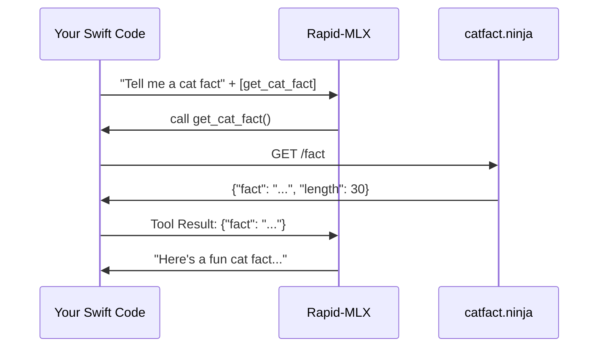

# Tool Calling Tutorial

> [!NOTE]
> This tutorial uses `catfact.ninja` as a free, no-auth endpoint to demonstrate tool calling.

## How it Works

The LLM does not execute code. It tells you which function to call, you execute it, and you send the result back so the LLM can generate a final response.



## Quick Start: `chatWithTools`

The simplest way to use tool calling. Define your tool, provide a handler closure, and the library manages the entire request/response loop -- including multi-round tool calls.

### Streaming

```swift
import Foundation
import RapidMLX

func catFactDemo() async throws {
    let client = RapidMLXClient()

    let catFactTool = Tool(function: FunctionDefinition(
        name: "get_cat_fact",
        description: "Retrieves a random cat fact",
        parameters: .object(["type": "object", "properties": .object([:]), "required": .array([])])
    ))

    let request = ChatCompletionRequest(
        messages: [.user("Tell me 3 cat facts")],
        tools: [catFactTool]
    )

    for try await event in client.chatWithTools(request, maxRounds: 10) { call in
        // This closure is called for each tool call the model makes.
        let (data, _) = try await URLSession.shared.data(
            from: URL(string: "https://catfact.ninja/fact")!
        )
        return String(data: data, encoding: .utf8) ?? "{}"
    } {
        switch event {
        case .content(let token):
            print(token, terminator: "")
        case .toolCallsReady:
            break  // optional: show "calling tool..." in your UI
        case .finished:
            print()
        }
    }
}
```

### Non-Streaming

For cases where you don't need to stream tokens:

```swift
let response = try await client.chatWithTools(request) { call in
    let (data, _) = try await URLSession.shared.data(
        from: URL(string: "https://catfact.ninja/fact")!
    )
    return String(data: data, encoding: .utf8) ?? "{}"
}
print(response.firstText ?? "")
```

## Typed Argument Decoding

Use `decodedArguments()` on a `ToolCall` to decode the JSON arguments into a Swift struct instead of parsing the raw string:

```swift
struct WeatherArgs: Decodable {
    let location: String
}

// Inside your handler:
let args: WeatherArgs = try call.decodedArguments()
print(args.location)  // "London"
```

## Mid-Level: `chatStreamEvents`

If you need more control than `chatWithTools` but still want automatic delta accumulation, use `chatStreamEvents`. This gives you assembled tool calls without the automatic execution loop -- you handle tool execution yourself.

```swift
func streamEventDemo() async throws {
    let client = RapidMLXClient()
    let catFactTool = Tool(function: FunctionDefinition(
        name: "get_cat_fact",
        description: "Retrieves a cat fact",
        parameters: .object(["type": "object", "properties": .object([:]), "required": .array([])])
    ))

    let request = ChatCompletionRequest(
        messages: [.user("Tell me a cat fact")],
        tools: [catFactTool]
    )

    for try await event in client.chatStreamEvents(request) {
        switch event {
        case .content(let token):
            print(token, terminator: "")
        case .toolCallsReady(let calls):
            // Tool calls are fully assembled -- execute them yourself
            print("\n[Model requested: \(calls.map(\.function.name))]")
        case .finished(let message):
            // Complete assistant message -- append to your conversation history
            print()
        }
    }
}
```

## Low-Level: Manual Tool Calling

For full control over the wire protocol, use the raw `chat` and `chatStream` methods directly.

### Non-Streaming (Manual)

```swift
import Foundation
import RapidMLX

func manualCatFactDemo() async throws {
    let client = RapidMLXClient()

    let catFactTool = Tool(function: FunctionDefinition(
        name: "get_cat_fact",
        description: "Retrieves a random cat fact",
        parameters: .object(["type": "object", "properties": .object([:]), "required": .array([])])
    ))

    // 1. Initial request with tools
    let request = ChatCompletionRequest(
        messages: [.user("Tell me a cat fact")],
        tools: [catFactTool],
        toolChoice: .auto
    )
    let response = try await client.chat(request)

    // 2. Check for tool calls
    guard response.hasToolCalls, let toolCall = response.firstToolCalls?.first else {
        print(response.firstText ?? "No response")
        return
    }

    // 3. Execute function
    let (data, _) = try await URLSession.shared.data(from: URL(string: "https://catfact.ninja/fact")!)
    let resultJSON = String(data: data, encoding: .utf8) ?? "{}"

    // 4. Send result back
    let followUp = ChatCompletionRequest(
        messages: [
            .user("Tell me a cat fact"),
            response.firstMessage!,
            .toolResult(callId: toolCall.id, content: resultJSON)
        ],
        tools: [catFactTool]
    )
    let finalResponse = try await client.chat(followUp)
    
    print(finalResponse.firstText ?? "")
}
```

### Streaming with `ChunkAccumulator` (Manual)

When streaming, tool calls arrive as incremental deltas. Use `ChunkAccumulator` to reassemble them:

```swift
func lowLevelStreamingDemo() async throws {
    let client = RapidMLXClient()
    let catFactTool = Tool(function: FunctionDefinition(
        name: "get_cat_fact",
        description: "Retrieves a cat fact",
        parameters: .object(["type": "object", "properties": .object([:]), "required": .array([])])
    ))

    var accumulator = ChunkAccumulator()
    var gotToolCalls = false

    let request = ChatCompletionRequest(messages: [.user("Tell me a cat fact")], tools: [catFactTool])
    for try await chunk in client.chatStream(request) {
        accumulator.append(chunk)
        
        if let token = chunk.firstContentToken {
            print(token, terminator: "")
        }
        if chunk.isToolCallFinish {
            gotToolCalls = true
        }
    }

    guard gotToolCalls else {
        print()
        return
    }

    let assistantMsg = accumulator.message
    var messages: [ChatMessage] = [.user("Tell me a cat fact"), assistantMsg]

    for call in assistantMsg.toolCalls ?? [] {
        let (data, _) = try await URLSession.shared.data(from: URL(string: "https://catfact.ninja/fact")!)
        messages.append(.toolResult(callId: call.id, content: String(data: data, encoding: .utf8) ?? "{}"))
    }

    for try await chunk in client.chatStream(ChatCompletionRequest(messages: messages, tools: [catFactTool])) {
        if let token = chunk.firstContentToken {
            print(token, terminator: "")
        }
    }
    print()
}
```

### Multi-Round Manual Loop

If a task might require multiple tool calls in sequence:

```swift
var messages: [ChatMessage] = [.user("Tell me 3 cat facts")]

for _ in 0..<10 { // Safety limit
    let res = try await client.chat(ChatCompletionRequest(messages: messages, tools: [catFactTool]))

    guard res.hasToolCalls, let calls = res.firstToolCalls else {
        print(res.firstText ?? "")
        break
    }

    messages.append(res.firstMessage!)

    for call in calls {
        let (data, _) = try await URLSession.shared.data(from: URL(string: "https://catfact.ninja/fact")!)
        messages.append(.toolResult(callId: call.id, content: String(data: data, encoding: .utf8) ?? "{}"))
    }
}
```
