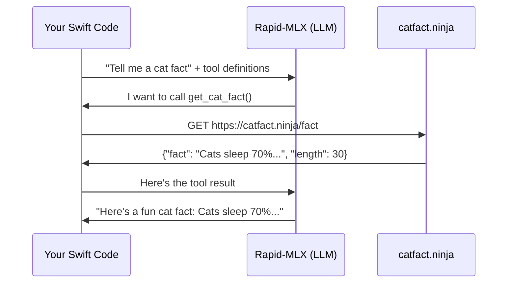

# Tool Calling Tutorial: Cat Facts

> [!NOTE]
> The original `cat-fact.herokuapp.com` API returns 503 (Heroku free tier sunset). This tutorial uses `catfact.ninja` instead -- same concept, working endpoint, no API key required.

---

## How Tool Calling Works

The LLM does **not** call the function itself. The flow is a three-step conversation loop where **your code** is the executor:



The LLM **decides** it needs to call a function and tells you which one. You execute it, send the result back, and the LLM produces the final answer. The package models this as data -- your code drives the loop.

---

## Step-by-Step Implementation

### 1. Define the Tool

Tell the LLM what functions are available. This is a JSON Schema description -- not Swift code the LLM runs, just metadata it reads to decide what to call:

```swift
import RapidMLX

let catFactTool = Tool(function: FunctionDefinition(
    name: "get_cat_fact",
    description: "Retrieves a random cat fact from the internet",
    parameters: .object([
        "type": "object",
        "properties": .object([:]),   // no parameters needed
        "required": .array([])
    ])
))
```

The `parameters` field is a JSON Schema. This tool takes no arguments, so the schema is an empty object.

### 2. Send the Request with Tools

```swift
let client = RapidMLXClient()

let request = ChatCompletionRequest(
    messages: [
        .user("Tell me something interesting about cats")
    ],
    tools: [catFactTool],
    toolChoice: .auto   // let the LLM decide whether to call the tool
)

let response = try await client.chat(request)
```

### 3. Check if the LLM Wants to Call a Tool

The LLM might respond with text directly, or it might request a tool call. You check:

```swift
if response.hasToolCalls {
    // The LLM wants to call a function -- go to step 4
} else {
    // The LLM answered with text directly
    print(response.firstText ?? "")
}
```

### 4. Execute the Function Yourself

This is where **your code** does the actual work. The LLM told you which function to call -- you execute it:

```swift
guard let toolCall = response.firstToolCalls?.first else { fatalError() }

// The LLM said: "call get_cat_fact with arguments {}"
print(toolCall.function.name)       // "get_cat_fact"
print(toolCall.function.arguments)  // "{}"

// YOUR code calls the real API:
let (data, _) = try await URLSession.shared.data(
    from: URL(string: "https://catfact.ninja/fact")!
)
let factJSON = String(data: data, encoding: .utf8)!
// factJSON is something like: {"fact":"Cats sleep 70% of their lives.","length":31}
```

### 5. Send the Result Back to the LLM

Build the conversation history including the assistant's tool call message and your tool result, then send it back:

```swift
let followUp = ChatCompletionRequest(
    messages: [
        // Original user message
        .user("Tell me something interesting about cats"),
        // The assistant's response (contains the tool call)
        response.firstMessage!,
        // Your tool result
        .toolResult(callId: toolCall.id, content: factJSON)
    ],
    tools: [catFactTool]   // keep tools available in case it needs another call
)

let finalResponse = try await client.chat(followUp)
print(finalResponse.firstText ?? "")
// "Here's a fun cat fact: Cats sleep about 70% of their lives!"
```

---

## Complete Working Example

Here is the full thing as a single async function:

```swift
import Foundation
import RapidMLX

func catFactDemo() async throws {
    let client = RapidMLXClient()

    // 1. Define the tool
    let catFactTool = Tool(function: FunctionDefinition(
        name: "get_cat_fact",
        description: "Retrieves a random cat fact from the internet",
        parameters: .object([
            "type": "object",
            "properties": .object([:]),
            "required": .array([])
        ])
    ))

    // 2. Send request with tool
    let request = ChatCompletionRequest(
        messages: [.user("Tell me something interesting about cats")],
        tools: [catFactTool],
        toolChoice: .auto
    )

    let response = try await client.chat(request)

    // 3. Handle tool call or direct text
    guard response.hasToolCalls,
          let toolCall = response.firstToolCalls?.first,
          toolCall.function.name == "get_cat_fact" else {
        // LLM answered directly without calling the tool
        print(response.firstText ?? "No response")
        return
    }

    // 4. Execute the function
    let (data, _) = try await URLSession.shared.data(
        from: URL(string: "https://catfact.ninja/fact")!
    )
    let factJSON = String(data: data, encoding: .utf8) ?? "{}"

    // 5. Send result back
    let followUp = ChatCompletionRequest(
        messages: [
            .user("Tell me something interesting about cats"),
            response.firstMessage!,
            .toolResult(callId: toolCall.id, content: factJSON)
        ],
        tools: [catFactTool]
    )

    let finalResponse = try await client.chat(followUp)
    print(finalResponse.firstText ?? "No response")
}
```

---

## Key Concepts

| Concept | What happens |
|---------|-------------|
| **Tool definition** | You describe available functions as JSON Schema. The LLM reads this to decide what it can call. |
| **`toolChoice: .auto`** | The LLM decides whether to use a tool or answer directly. Use `.required` to force a tool call. |
| **`response.hasToolCalls`** | Check whether the LLM requested a function call instead of answering with text. |
| **`toolCall.function.arguments`** | A JSON string of the arguments the LLM chose. For `get_cat_fact` this is `"{}"` since it takes no params. |
| **`.toolResult(callId:content:)`** | How you send the function's output back. The `callId` must match the `toolCall.id`. |
| **Conversation history** | You must include the original message, the assistant's tool call message, and the tool result -- the LLM needs the full context. |

> [!IMPORTANT]
> The LLM never executes code. It only **requests** function calls. Your Swift code is always the executor. This is by design -- the package stays at the protocol layer per [AGENTS.md](file:///Users/ben/Documents/Projects/Rapid-MLX%20Swift/rapid-mlx-swift/AGENTS.md).

---

## Making It a Loop (Multiple Tool Calls)

If the LLM might need multiple tool calls in sequence, wrap it in a loop:

```swift
var messages: [ChatMessage] = [.user("Tell me 3 cat facts")]
let maxRounds = 10  // safety limit

for _ in 0..<maxRounds {
    let req = ChatCompletionRequest(messages: messages, tools: [catFactTool])
    let res = try await client.chat(req)

    guard res.hasToolCalls, let calls = res.firstToolCalls else {
        // Final text response
        print(res.firstText ?? "")
        break
    }

    // Add the assistant's message to history
    messages.append(res.firstMessage!)

    // Execute each tool call and append results
    for call in calls {
        let (data, _) = try await URLSession.shared.data(
            from: URL(string: "https://catfact.ninja/fact")!
        )
        let result = String(data: data, encoding: .utf8) ?? "{}"
        messages.append(.toolResult(callId: call.id, content: result))
    }
}
```
